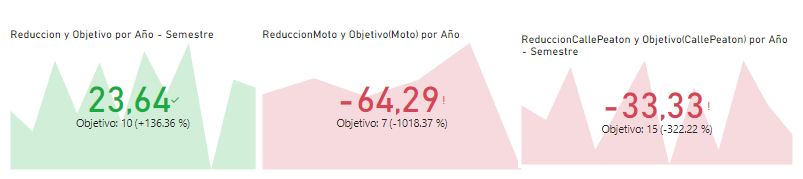

Los incidentes viales, conocidos coloquialmente como accidentes de tráfico, abarcan eventos que implican vehículos en las calles públicas y pueden originarse por diversas razones, como colisiones entre automóviles, motocicletas, bicicletas o atropellos a peatones, choques con objetos fijos o volcaduras de vehículos. Estos sucesos pueden acarrear desde daños materiales hasta lesiones graves o incluso la pérdida de vidas para aquellos involucrados.

En el contexto de una metrópolis como Buenos Aires, donde la circulación vehicular es intensa y la densidad poblacional es alta, los siniestros viales representan una inquietud de considerable envergadura. Dichos incidentes pueden afectar de forma significativa la seguridad de los residentes y visitantes de la ciudad, además de influir en la infraestructura vial y en la capacidad de respuesta de los servicios de emergencia. Las tasas de mortalidad vinculadas a estos sucesos son un indicador crítico para evaluar la seguridad en el tránsito en la región, y reducir estas tasas se convierte en una meta primordial para mejorar la seguridad en las calles y proteger vidas humanas. Para abordar este desafío, resulta esencial implementar medidas que comprenden desde la educación vial hasta el acatamiento de las regulaciones de tráfico, la mejora de la infraestructura vial y la promoción de vehículos más seguros, acompañadas de un seguimiento riguroso de las estadísticas y la aplicación de políticas eficaces.

ETL y EDA /n
De manera que pueda hacer un análisis representativo del contexto y los hechos ocurridos, se realizo un ETL elminando columnas casi vacías y no relevantes. Se cambio el tipo de dato de algunas otras como HH (para trabajar sin problemas en PowerBI) y la columna de los días, para una mejor lectura. En la etapa de EDA se notaron datos faltantes y luego se realizaorn algunas gráficas vinculando ciertas variables para seguir tomando decisiones con respecto al ETL y al futuro dashboard.

DASHBOARD 
Se hizo el dashboard en PowerBI describiendo en cada página, con adecuadas formas de representación y organización de datos, los datos que muestran las tablas, los valores importantes y las posibles relaciones entre las distintas categorías. Se decidió colocar en la última página el análisis de los KPI'S.

KPI's
Se determinaron 3 KPI'S:
1.- Reducción de un 10% la tasa de homicidios en siniestros viales de los últimos seis meses
2.- Reducción del 7% la cantidad de accidentes mortales de motociclistas en el último año, en CABA, respecto al año anterior.
3.- Reducción del 15% de los accidentes viales en las "calles" cuyas víctimas fueron peatones.

Conclusiones
La reducción de los accidentes no sigue un patrón. Se considera que haría falta mas información para poder optimizar el análisis.
Sin embargo, se ve que los accidentes de motociclistas van en aumento ya que en 2020 disminuyeron por la reducción de tránsito por el contexto panedemia pero en el 2021 se presenta un gran ascenso.
